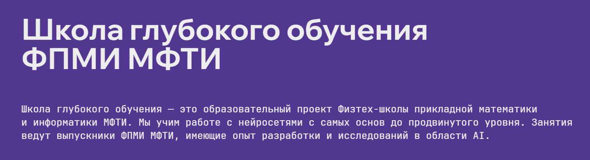

# Deep Learning School

В данном репозитории размещены материалы и выполненные проекты по курсу 1-го семестра - глубокого обучения и компьютерного зрения

## Описание проектов:
| Номер проекта | Название и ссылка | О чем проект                                                     |
|---------------|-------------------|------------------------------------------------------------------|
|1              |[Введение_1](https://drive.google.com/file/d/14Yc3dRmn87m_SSQbSMVOPfZi3Yt_1KYP/view)  [Введение_2](https://docs.google.com/presentation/d/1yi_dbIPsMqvdUoyaaDoxsVQi0_aOjl_E/edit#slide=id.p9)|Знакомство с DL|
|2              |[Linux\Bash](https://colab.research.google.com/drive/1P0RE43Ih9J9TmXkrpgfNwjFgsRIF3BPe?usp=sharing) |Основные команды терминала|
|3              |[Scilit-learn](https://github.com/AlexeyK12/DLS/blob/main/Homework_1_game_of_thrones_prediction_ipynb%22.ipynb) |ДЗ_1 - EDA и прогноз выживших героев "Игры престолов"|
|4              |[Линейные модели и методы оптимизации](https://github.com/AlexeyK12/DLS/blob/main/ДЗ_2__%22%5Bhomework%5Dlinear_models_fall_2024_ipynb%22.ipynb) |ДЗ_2 - Классы логистической регрессии для бинарной классификации и логистической регрессии с регуляризацией|
|5              |[Деревья принятия решений и ансамблевые алгоритмы](https://github.com/AlexeyK12/DLS/blob/main/ДЗ_2_%22hw_kaggle_ipynb%22.ipynb) |ДЗ_3 - соревнование DLS на Kaggle - прогнозирование оттока|
|6              |[Введение в PyTorch](https://github.com/AlexeyK12/DLS/blob/main/%22Введение_в_PyTorch_ipynb%22.ipynb) |База PyTorch для создания нейронных сетей|
|7              |[Torch_autograd](https://github.com/AlexeyK12/DLS/blob/main/%22Torch_autograd_ipynb%22.ipynb) |Подробнее об использовании тензоров и вычислении автоградиентов|
|8              |[Свёрточные нейронные сети](https://github.com/AlexeyK12/DLS/blob/main/Свёрточные%20нейронные%20сети.pdf) |Презентация CNN|
|9              |[Семинар_CNN_1_PyTorch](https://github.com/AlexeyK12/DLS/blob/main/%5Bseminar%5Dconvnet_pytorch.ipynb)  [Семинар_CNN_2_Pooling](https://github.com/AlexeyK12/DLS/blob/main/%5Bseminar%5Dconvolution_pooling.ipynb)   [Семинар_CNN_3_Practice](https://github.com/AlexeyK12/DLS/blob/main/%5Bseminar%5Dcreating_module.ipynb)|Семинары по CNN|
|10              |[Полносвязные и свёрточные нейронные сети](https://github.com/AlexeyK12/DLS/blob/main/ДЗ_4_%22%5Bhomework%5Ddense_and_convolutional_nn_ipynb%22.ipynb) |ДЗ_4 - по FCN и CNN|
